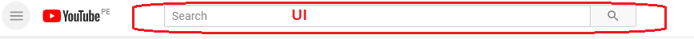
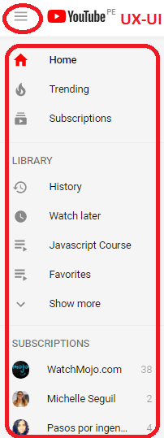
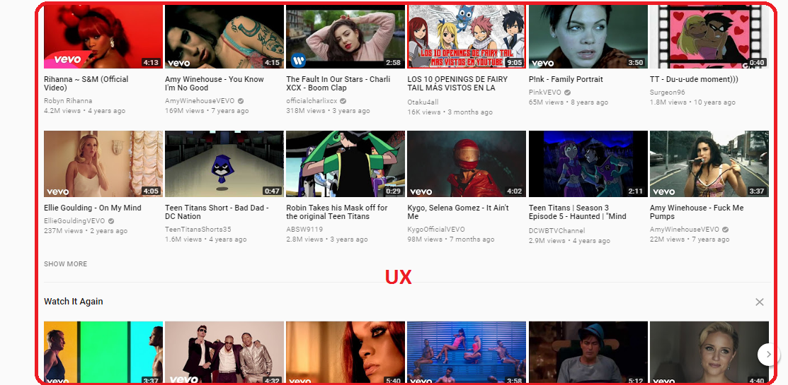
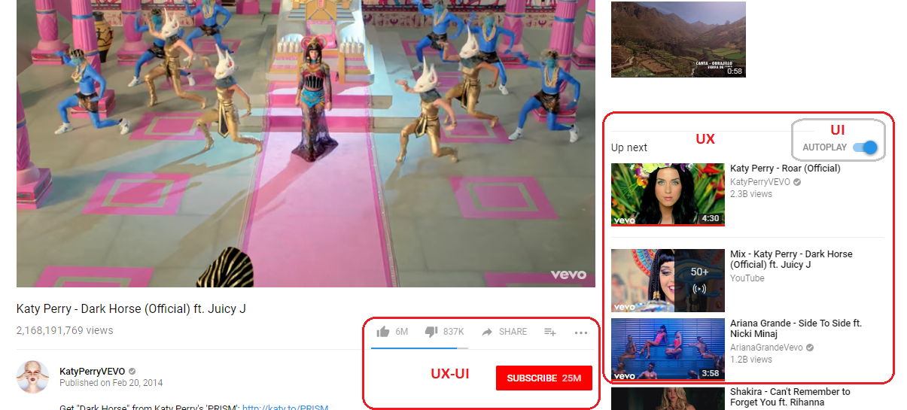
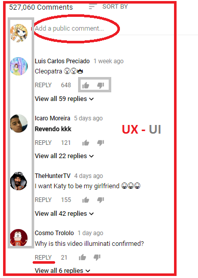

# Youtube: Elementos UI - UX

En este reto de codigo vamos a  navegar la pagina de Youtube e Indicar las partes UX y UI para un mejor entendimiento de ambos terminos.
1. 
En este ejemplo podemos ver el elemento local para poder buscar videos de la preferencia del usuario; Este elemento pertenece a UI ya que sería creado por un tipo de elemento input.

2. En este navegador vertical podemos ver un claro ejemplo de ambas especialidades: **UX y UI**; El motivo del cual es **UX** es porque le da al cliente una lista de opciones directas sobre videos anteriormente vistos y guardados, y no la incomodidad de andar buscando algo que tienen en la sección del historial. Esto se combina con **UI** ya que el historia y menu de navegación (hamburguesa) están compuestos por _inputs_ y _anchors (enlaces)_:

3. La sección de videos se considería como **UX** dado que el sistema me sugiera vídeos que me podrían gustar según con videos parecidos que he visto anteriormente:

4. 
Si revisamos la siguiente imagen, al extremo derecho, veremos un recuadro que dice **UX** dado que el sistema me sugiere de una manera mas directa, videos parecidos al cual yo estoy viendo en ese mismo instante; ademas podemos observar que dentro del recuadro de **UX** se encuentra **UI** dado que la opción _autoplay_ es creado con UI para luego despues crearle funcionalidad con un lenguaje de programación.

 A la vez, podemos ver a su izquierda un recuadro que indica **UX-UI** dado que se basa en _iconos_ como el "Me Gusta" o "Disgusta" y el _botón_ "Suscribirse" estan dentro de la funcionalidad de diseños (UI) pero va de la mano de UX ya que como usuaría, quisiera ver cuantas personas han visto el video y les ha gustado o no.

5. Bajo el video que podemos estar viendo encontramos la sección de comentarios donde los usuarios pueden dejar sus diversas opiniones sobre el video observado el cual sería etiquetado como un elemento **UX** dado que es un servicio para que el usuario usuario se exprese y otros puedan opinar sobre lo que se haya comentado, uniendo y compartiendo ideas. Sin embargo, a la vez es catalogado como **UI** ya que ingresar comentarios es una funcionalidad de formularios.

6. Al Ingresar a la pagína de youtube, en el extremo derecho superior, podemos verificar algunos iconos el cual tendría la funcionalidad del elemento **UI** dado que es un tipo de navegación y las imagenes que podamos elegir como foto de perfil tienen un efecto border-radius el cual se produce mediante _user interface o JS_ pero a la vez, vemos el elemento **UX** ya que los iconos le ayudan al usuario a entender para que sirven sin tener escritas alguna palabra. Por ejemplo, vemos que el icono que contiene la flecha hacia arriba es para _subir_ un video; El que le sigue, cual tiene varios recuadros,  nos indica opciones extras para exploración adicionales al usuario; El tercero son notificaciones que el usuario recibe y el ultimp icono con una imagen redondeada, se sobrentiende que es el perfil personal del usuario

> Reto de codigo Realizado por Franshesca Quezada
